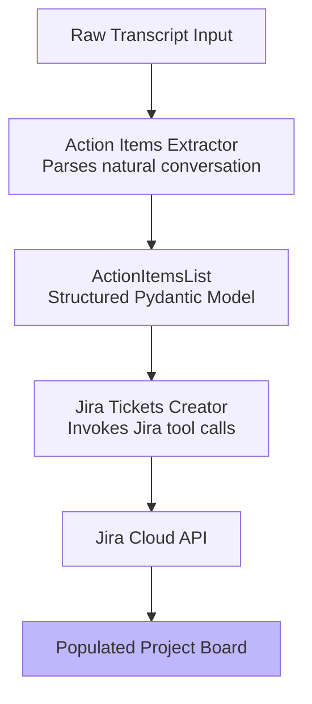

# TaskPilot - Meeting Transcript to Jira Tickets

An agentic workflow that converts meeting transcripts into structured action items and automatically creates corresponding Jira issues using the OpenAI Agents SDK.

---

## System Flow



---

## Key Capabilities

- Extracts actionable tasks and Jira-related fields from meeting transcripts.
- Validates agent outputs using structured Pydantic models.
- Creates Jira issues through function tools and the Jira REST API.
- Records the complete workflow using OpenAI Agents SDK tracing.
- Includes automated tests for the agents, Jira integration, and orchestration flow.

---

## Example Workflow

### 1. Sample Raw Meeting Transcript

Save the meeting transcript in `meeting_transcript.txt` or provide its content directly to the workflow orchestrator.

> *"Alright team, let's jump into the TaskPilot status sync for the TEST project. We really need to get the GenAI readiness stuff deployed, but we have some annoying bugs blocking us. The integration test client is crashing with a FileNotFoundError because the settings parser is looking in the wrong directory level and missing the project root parent. Someone needs to refactor the config parser to resolve paths absolutely from the project root directory. We need this absolute path fix wrapped up by tomorrow morning as it's blocking the deployment pipeline. Mark it as High priority... We also need to re-architect `local_agents/__init__.py` to export the base class and add the `__all__` list properly... and finally we need a `load_meeting_transcript_txt` utility function built using `pathlib`."*

### 2. Structured Action-Item Extraction

The Action Items Extractor analyzes the transcript and returns a validated `ActionItemsList`.

Example extracted action item:

```json
{
  "title": "Fix configuration path resolution",
  "description": "Refactor the configuration parser to resolve paths from the project root.",
  "assignee": "Avital",
  "status": "To Do",
  "issuetype": "Task",
  "project": "TEST",
  "due_date": "2026-07-20",
  "start_date": null,
  "priority": "High",
  "parent": null,
  "children": null
}
```

### 3. Live Automated Jira Workspace Generation

* The Jira Tickets Creator receives the structured action items and invokes the Jira creation tool for each task.

* The system maps the extracted project identifier, title, description, issue type, due date, and other supported fields into Jira REST API requests.

---

## Project Structure

```text
Task-Pilot-Jira/
├── .gitignore
├── config.yml.example
├── meeting_transcript.txt
├── README.md
├── requirements.txt
├── docs/
│   └── taskpilot-demo.pdf
└── taskpilot/
    ├── __init__.py
    ├── main.py
    ├── taskpilot_runner.py
    ├── local_agents/
    │   ├── __init__.py
    │   ├── action_items_extractor.py
    │   └── tickets_creator.py
    ├── utils/
    │   ├── __init__.py
    │   ├── agents_tools.py
    │   ├── config_parser.py
    │   ├── jira_interface_functions.py
    │   └── models.py
    └── tests/
        ├── __init__.py
        ├── test_config.py
        ├── test_jira_client.py
        └── test_local_agents.py
```

- `main.py` — loads the meeting transcript and starts the workflow.
- `taskpilot_runner.py` — orchestrates both agents and enables workflow tracing.
- `action_items_extractor.py` — extracts structured action items from the transcript.
- `tickets_creator.py` — creates Jira issues from the extracted action items.
- `agents_tools.py` — exposes Jira operations as tools available to the agents.
- `jira_interface_functions.py` — communicates with the Jira REST API.
- `models.py` — defines the structured Pydantic input and output models.
- `tests/` — contains configuration, agent, integration, and workflow tests.

---

## Configuration

### Environment Variables

Create a `.env` file in the repository root:

```bash
OPENAI_API_KEY=your_openai_api_key
ATLASSIAN_API_KEY=your_atlassian_api_token
```

The Atlassian API token must belong to the Jira user configured in `config.yml`.

### Application Configuration

Copy the configuration template:

```powershell
Copy-Item config.yml.example config.yml
```

Update `config.yml` with your own settings:

```yaml
agents:
  model: "{model-name}"
jira:
  url_rest_api: "https://{user-name}.atlassian.net/rest/api/3/"
  user: "{email-user}@{gmail/else}.com"
  request_timeout: {timeout-in-seconds}
```

---

## Getting Started

### Clone the Repository

```bash
git clone https://github.com/AvitalFinanaser/Task-Pilot-Jira.git
cd Task-Pilot-Jira
```

### Create and Activate a Virtual Environment

```powershell
py -3.11 -m venv .venv
.\.venv\Scripts\Activate.ps1
```

### Install Dependencies

```powershell
python -m pip install -r requirements.txt
```

### Prepare the Input

Place the meeting transcript in:

```text
meeting_transcript.txt
```

### Run the Workflow

```powershell
python -m taskpilot.main
```

The application reads the transcript, extracts the action items, creates the Jira issues, and prints a link to the OpenAI execution trace.

---

## Testing

Run the tests from the repository root:

```powershell
python -m pytest -s -v
```